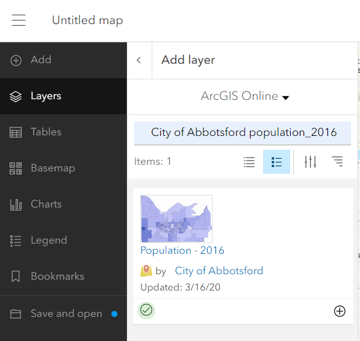
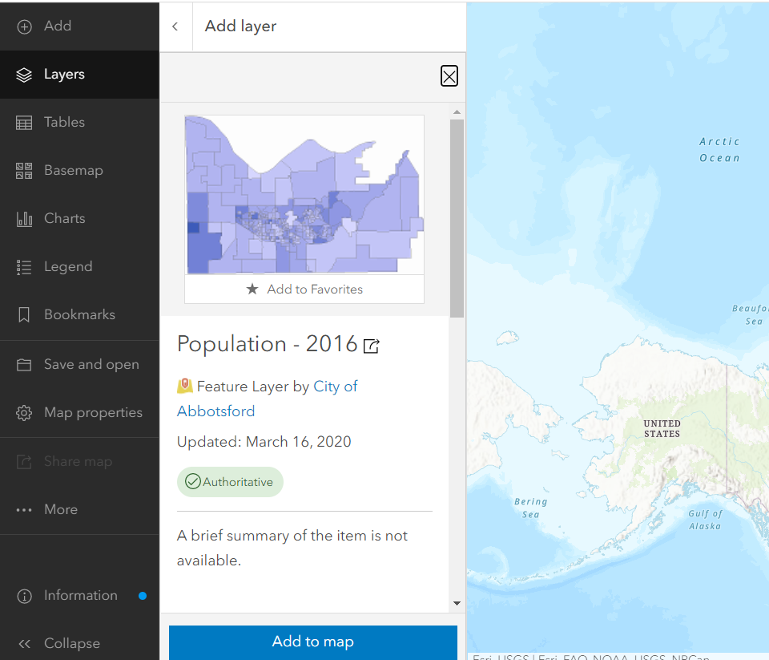

## Add data layer from ArcGIS Online Community

# Create a population map

*1*{: .circle .circle-blue} Click on the **map** tab and back to the map view.

*2*{: .circle .circle-blue} On the sidebar on the left, click on **Layers**, then on **Add layer** in the **Layers** pane that opens.

*3*{: .circle .circle-blue} From the dropdown arrow next to **My Content**, select **ArcGIS Online**.

{: .note}
[ArcGIS Online community](https://doc.arcgis.com/en/arcgis-online/reference/add-layers.htm)—Includes layers you've added, layers from groups you belong to, and public layers.

*4*{: .circle .circle-blue} Where it says **Search for layers**, type "City of Abbotsford population_2016", and hit enter to see what layers may be available. Click on “Population - 2016” by City of Abbotsford. An information dialogue will open with information about this layer.

*5*{: .circle .circle-blue} Click the **Add to Map** button, then click arrow next to Add layer search bar to see the list of layers. ArcGIS Online will choose a symbology for you, and the legend using this symbology will appear in the Symbology pane to the right of the map.

*6*{: .circle .circle-blue} **Save** the population web map that we just created.

