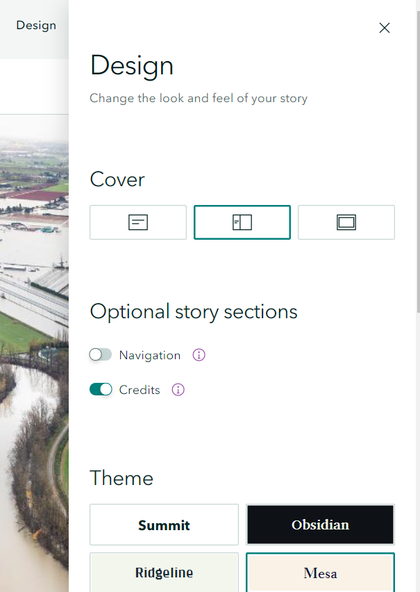
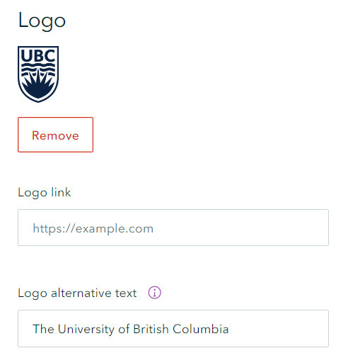

## Configure design and add a logo

*1*{: .circle .circle-blue} Click the **Design** on the top of the page. It will pop up a panel that allows us to select the style of cover page, optional story sections (e.g Navigation, credits) and theme. Feel free to select the cover and theme that works for your topic. 

*2*{: .circle .circle-blue} Scroll down the **Design** panel, you can upload a logo for your institution or project. Click the **Upload Logo** and select the ubc logo in the downloaded .zip file. You can provide an alternative text, in case the image does not load appropriately.

