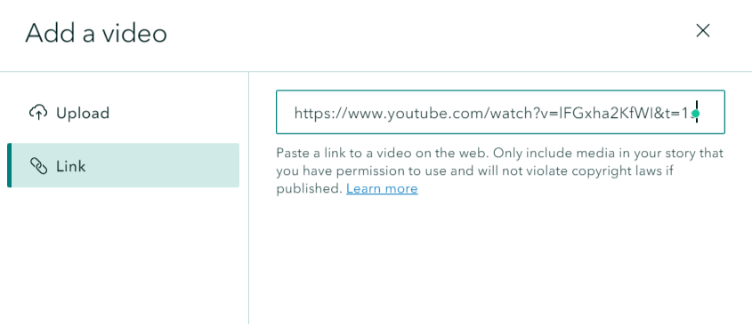
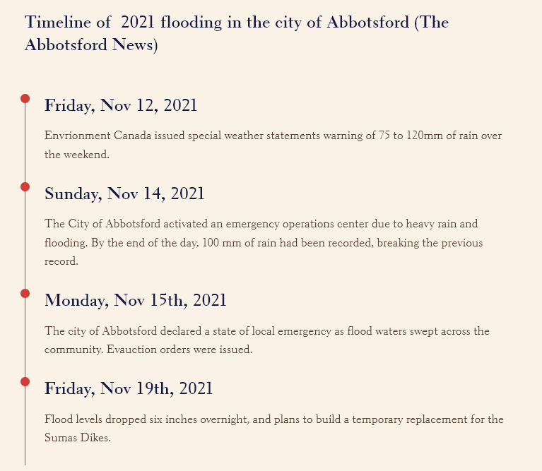

## Embed media to the Story Map

### Insert a video

*1*{: .circle .circle-blue} Click the **green plus button** again and select **video**. You can upload videos from local devices or insert a link. Insert this link <https://www.youtube.com/watch?v=lFGxha2KfWI&t=1s> to add a YouTube video to the Story Map.

### Create a Timeline

{: .note}
This feature is not available for public account.

*2*{: .circle .circle-blue} Click the **green plus button** and select **Timeline** to illustrate a series of events choronolgically. There are three timeline layout, choose **Single side** for this case.

Add following texts for the timeline:

Timeline of  2021 flooding in the city of Abbotsford (The Abbotsford News)

- Friday, Nov 12, 2021
    - Environment Canada issued special weather statements warning of 75 to 120mm of rain over the weekend.
    
- Sunday, Nov 14, 2021
    - The City of Abbotsford activated an emergency operations center due to heavy rain and flooding. By the end of the day, 100 mm of rain had been recorded, breaking the previous record.
- Monday, Nov 15th, 2021
    - The city of Abbotsford declared a state of local emergency as flood waters swept across the community. Evacuation orders were issued.

