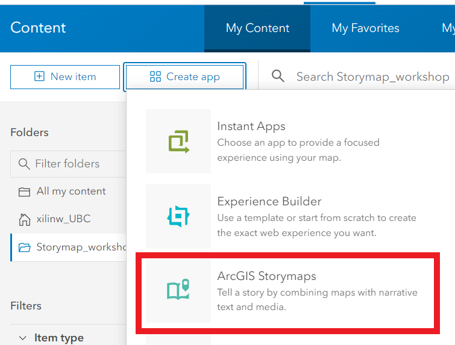

## ArcGIS Online Storymap

To start a Storymap from scratch, go to [Story Maps](https://storymaps.arcgis.com/stories) and click on New Story.

Or from the top left of your web map, click on the three horizontal lines dropdown arrow and then right-click on **Content**. Click on the **Create app** and select **ArcGIS Storymaps**.

The Storymap Content blocks and features will be covered in this section:
- Configure themes and add a logo (Subscription only)
- Preview the Storymap
- Add basic features
    - Add title, subtitle, and Text
    - Add a Separator
- Embed media
    - Add a video
    - Add a Timeline (Subscription only)
- Embed immersive content and media
    - Sidecar
        - Add texts
        - Add maps
    - Slideshow
        - Swipe
        - Single color background and add text
    - Map Tour
        - Insert a link 
        - Add a button
- Publish and share the story map

[Check out the example Storymap](https://storymaps.arcgis.com/stories/9d2a3452e2a141399ae6226a627b4a36)