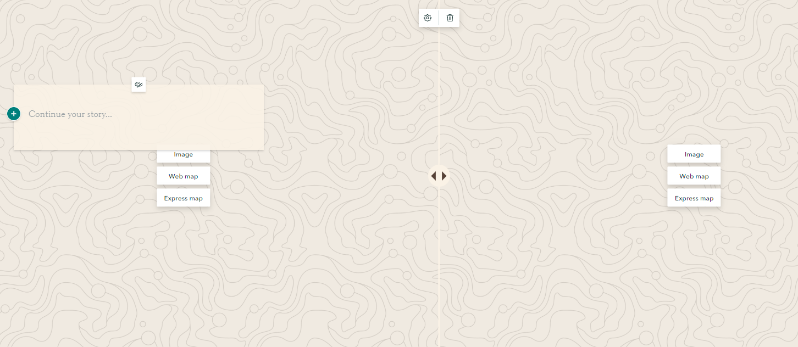

## ArcGIS Online Storymap

To start a Storymap from scratch, go to [Story Maps](https://doc.arcgis.com/en/arcgis-storymaps/gallery/?rsource=https%3A%2F%2Fwww.esri.com%2Fen-us%2Farcgis%2Fproducts%2Farcgis-storymaps%2Fstories) and click on New Story.

Or from the top left of your web map, click on the three horizontal lines dropdown arrow and then right-click on **Content**. Click on the **Create app** and select **ArcGIS Storymaps**.

 

The Storymap Content blocks and features will be covered in this section:
- Configure themes and add a logo
- Preview the Storymap
- Add basic features
    - Add title, subtitle, and Text
    - Add a Separator
- Embed media
    - Add a video
    - Add a Timeline
- Embed immersive content and media
    - Sidecar
        - Add texts
        - Add maps
    - Slideshow
        - Swipe
        - Single color background and add text
    - Map Tour
        - Insert a link
        - Add a button
- Publish and share the story map

*8*{: .circle .circle-blue} Click the **green plus botton** and select sidecar to add an immersive block with media panel and narrative panel. There are three layouts of sidecar, **Docked**, **Floating** and **Slideshow**. Feel free to select any of them work best for your story, but select Docked for this workshop.

*9*{: .circle .circle-blue} Click the **green plus botton** inside sidecar narrative panel and select text to add some population data about the city of Abbotsford:

    About Abbotsford

    Area: 375.6 km2

    Population: 149,928

    Population density: 399 residents per km2

*10*{: .circle .circle-blue} Click the **Add** inside the media panel and select Map to add the **Population of the City of Abbotsford** web map created in previous section. Then, adjust the map extent and click **Options** on the left sidebar to display the legend of the map.

*11*{: .circle .circle-blue} Add a new slide by clicking the **green plus button** in the side bar. Then, repeat Step 10 and 11 for the "Flood Risk of the City of Abbotsford" and add the descriptive text below:

Floods are common on the West coast of Canada and can happen any time of the year. Thus, it is significant for residents to be prepared for future flooding events. The flood risk map illustrates the flood risk of the city of Abbotsford in five levels: low, mid-low, medium, mid-high, and high.

*12*{: .circle .circle-blue} Click the **green plus botton** and select sidecar to add a full-screen, media-focused layout with minimal accompanying text. Click the **Add** and select **Swipe** let readers easily compare two maps or images with an interactive slider. Add the before and after floods image provided in the downloaded .zip.
Then,Click the textbox and add the following descriptive text: 

What you should do if you must evacuate?

Always follow the instruction of local emergency officials
Ensure each family member has waterproof clothing and footwear
Lock all doors and windows and ensure gas, eletricity and water are shut off
(the City of Abbotsford)

*13*{: .circle .circle-blue} Add a new slide by clicking the **green plus button** in the side bar. Then, click the **add** and select color to change the background to a single color and add the descriptive text below:

What should you do after a flood?

Check if the water supply is safe to drink 
Avoid floodwaters since it may be contaminated or electrically charged
Return home only when authorities indicate it is safe
Contact insurance and utility companies

[The city of Abbotsford](https://www.abbotsford.ca/weather/flood-preparation)

*14*{: .circle .circle-blue} Click the **green plus botton** on the main page and select **separator** to break your content into clear sections with a subtle visual cue.

*15*{: .circle .circle-blue} Let us explore some Tourism Attraction in the city of Abbotsford. Click the **green plus botton** on the main page and select **map tour** to showcase a set of places your readers can explore in any order, or be led through one at a time. Choose start from scratch and guided and map focus as layout. Click the add image to Add your prepared image here or insert a link: https://www.flickr.com/photos/spetersongallery/38464945140

*16*{: .circle .circle-blue} Click the **green plus botton** within the text box to add a title **Mill Lake** and add **"Take me to Google Street View"** into a **Botton**. You use google map to find the Google Street View of Mill Lake, and copy the link to the Botton. Then, click **add location** and search and add the location of **Mill Lake, BC** to the map

*17*{: .circle .circle-blue} Add a new slide by clicking the **green plus button** in the side bar. Then, repeat Step 15 and 16 to add one more tourism attraction in the city of Abbotsford by yourself.

{: .note}
The **Map Options** on the top right corner of Map Tour can adjust the map appearance, such as zoom level, basemap, point color and map type (2D or 3D).

[Check out the example Storymap](https://storymaps.arcgis.com/stories/9d2a3452e2a141399ae6226a627b4a36)