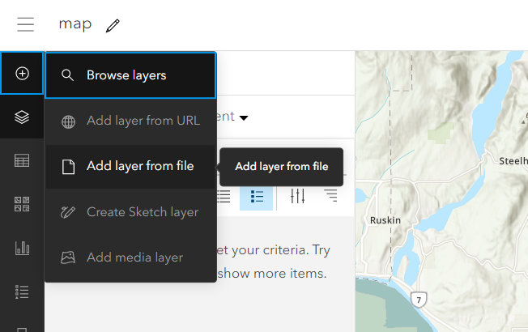
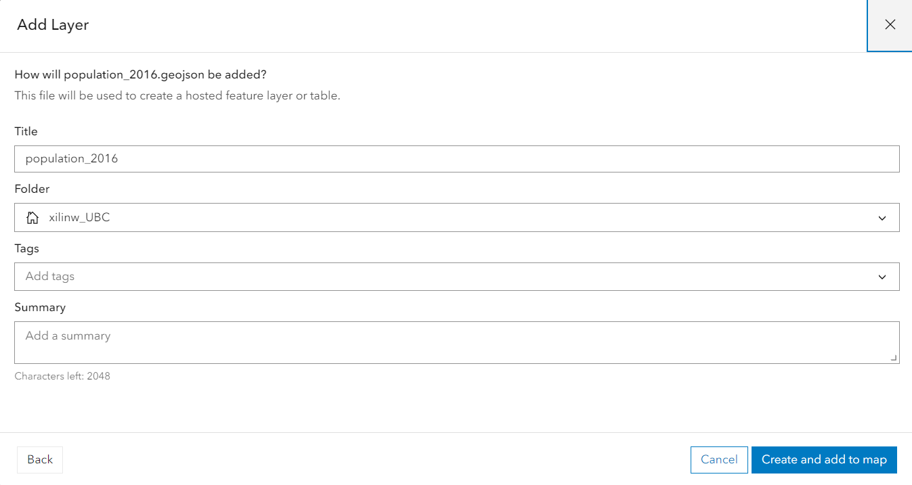
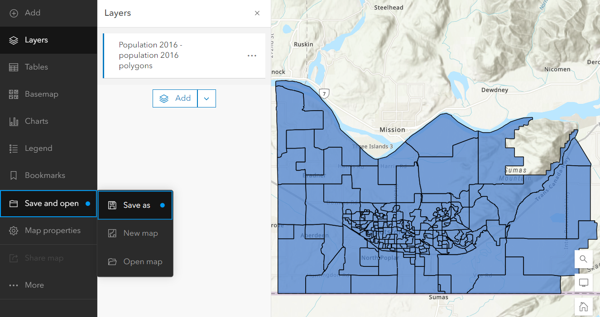

## Add data layer from local 

{: .note}
The public account follows the same procedure to add data from local to your ArcGIS online account, but it only accepts CSV, GeoJSON and KML. If you have Shapefile, you can convert it to GEOJSON.

*1*{: .circle .circle-blue} Click on the **Create new folder**, create a folder named Story Map Workshop.

*2*{: .circle .circle-blue} Click on the **map** tab and back to the map view.

*3*{: .circle .circle-blue} click on the **Plus sign** on the top left of the page. 

*4*{: .circle .circle-blue} upload **Population_2016** from downloaded data to the **Storymap_workshop** folder and add it to the map.

{: .note}
If you want to add shapefile to your ArcGIS Online account, you need to store your shapefile in .zip

*5*{: .circle .circle-blue} **Save** the population map that we just created.

