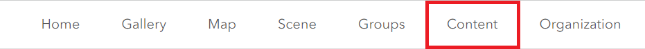
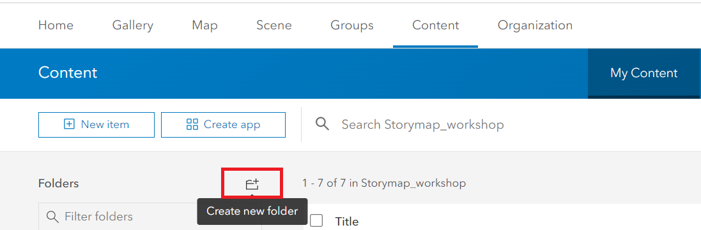
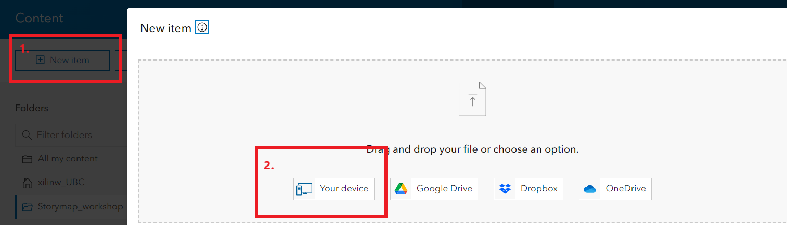
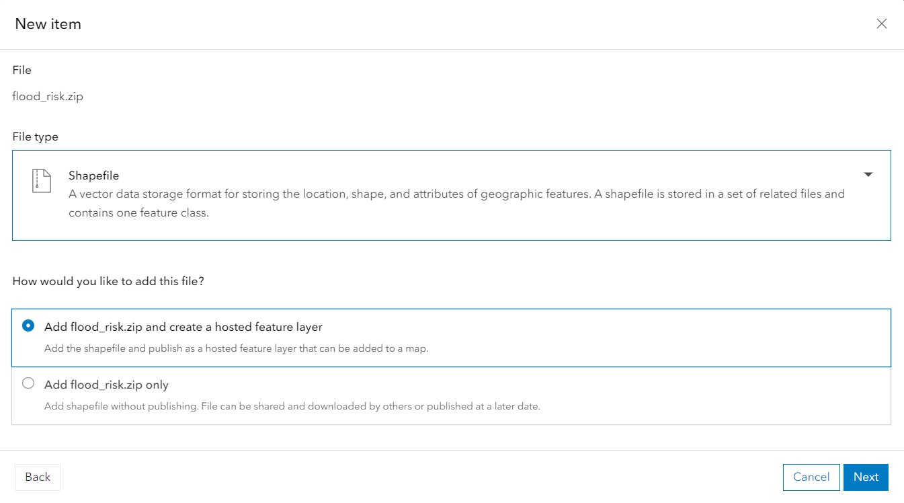
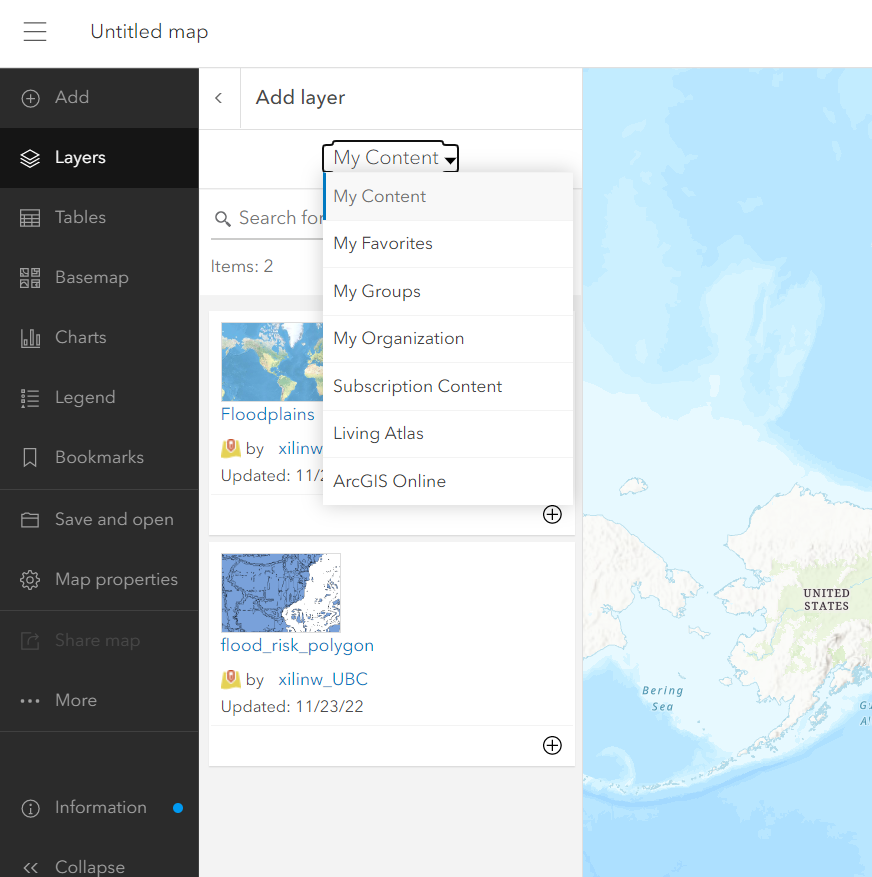
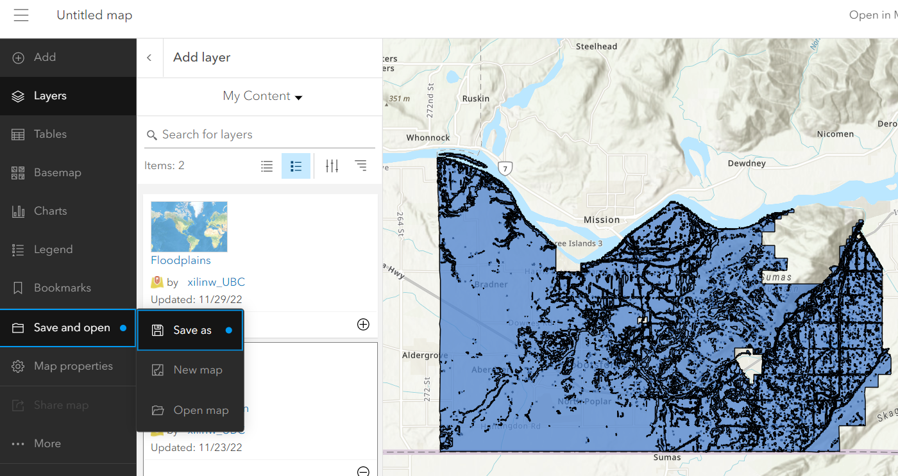

## Add data layer from local 

# Create a flood risk map

*1*{: .circle .circle-blue} From the ribbon at the top of the page, click on the **Content** tab. 

*2*{: .circle .circle-blue} Click on the **Create new folder**, create a folder named Storymap Workshop.

*3*{: .circle .circle-blue} Click on the **Create new folder**, create a folder named Storymap Workshop.

 Click on the **New Item** to add data from **Your device**. [ArcGIS online supports .zip, csv, GeoJSON, kml etc.](https://doc.arcgis.com/en/arcgis-online/reference/supported-items.htm) In this workshop, we will add a shapefile to ArcGIS online. 

{: .note}
You need to store your shapfile in .zip

*3*{: .circle .circle-blue} upload **flood_risk.zip** from downloaded data to the **Storymap_workshop** folder and create a hosted feature layer.

*4*{: .circle .circle-blue} Click on the **map** tab and back to the map view.

*5*{: .circle .circle-blue} Add the **flood_risk_polygon** from **My Content**.

*6*{: .circle .circle-blue} **Save** the flood risk map that we just created.

