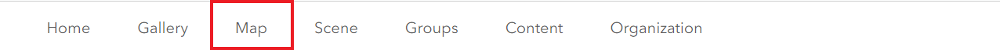
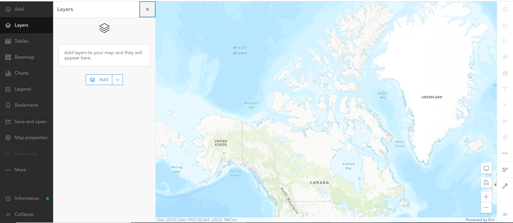

## Create a Web Map

An ArcGIS web map is an interactive display of geographic information that you can use to tell stories and answer questions. Please sign into the ArcGIS online account before proceeding to the next step.

{: .note}
The public account and organization account have different user interface and functions. The public account do not have access to some functions, please be mindful with the following hands-on steps.

*1*{: .circle .circle-blue} From the ribbon at the top of the page, click on the Map tab. This will open a new map.

*2*{: .circle .circle-blue} Feel free to play around with interactive icons and the tools from sidebar. 

[Review from previous AGOL workshop](https://ubc-library-rc.github.io/intro-AGOL/content/create-a-web-map.html)

