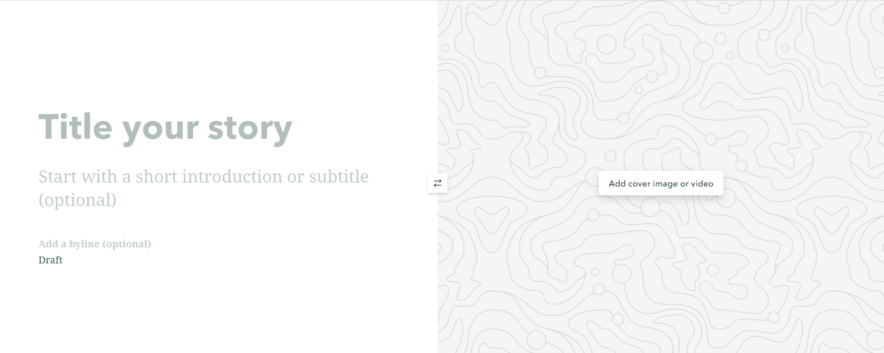
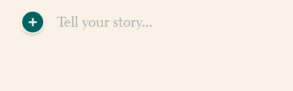

## Add basic features to Storymap

### Add a title

*1*{: .circle .circle-blue} Now add **"The City of Abbotsford"** as a title, and **"A Flood Analysis in the city of Abbotsford, BC"** as a subtitle.

### Insert a image for cover page

*2*{: .circle .circle-blue} Insert a image for the cover page from local files. You can use the prepared cover image in the downloaded .zip file or use your own image.

### Add descriptive text

*3*{: .circle .circle-blue} Click the **green plus button** to add a text content block. Then, add the following descriptive text about the city of Abbotsford floods. 

"In November 2021, Abbotsford experienced one of Canada’s largest flooding disasters when the Nooksack River overflowed and breached its dyke and floodwater headed straight to Abbotsford, flooding Sumas Prairie. This event forced the closure of the US/Canada Border and Highway 1, effectively stopping the flow of people, goods and services and led to a significant loss of livestock and poultry, as well as the evacuation of over 1,100 properties and over 3,300 people from their homes" (The city of Abbotsford)."

### Add a separator
*4*{: .circle .circle-blue} Click the **green plus button** on the main page and select **separator** to break your content into clear sections with a subtle visual cue.