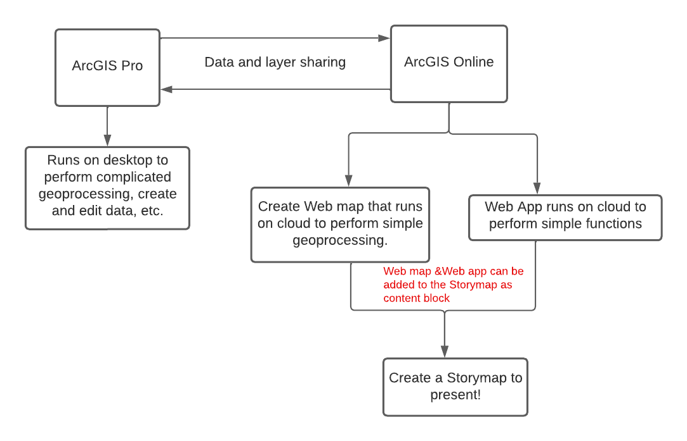

# Introduction

## What is GIS?

[Geographic Information System](https://www.esri.com/en-us/what-is-gis/overview) is a spatial system that creates, manages, analyzes, and maps all types of data. GIS helps users understand patterns, relationships, and geographic context. Thus, improving communication, efficiency, management and decision-making.

## How is GIS used?
GIS provides a foundation for mapping and analysis that is used in science and most industry. For instance:
- [Identify present-day environmental inequalities to redlining policies](https://storymaps.arcgis.com/stories/0f58d49c566b486482b3e64e9e5f7ac9)

- [Visualize and communicate environmental changes](https://storymaps.arcgis.com/stories/5a231e5e7d474bb886f1172f51b4b019)

- [Perform forecasting such as predict and prepare for flooding](https://storymaps.arcgis.com/stories/4faf6d052c8f41b3b9b99c506642bca5)

## Desktop GIS vs. Online GIS

Desktop GIS is software installed on a computer, the data created through software will be saved locally. Desktop software has more capability to perform complex analysis and customize the display of data better than online GIS.

- Example: ArcGIS Pro, QGIS

Online GIS or Web GIS is powered by web services that deliver data and capabilities and connect components. Web GIS can be implemented in cloud or as a hybrid combination of desktop and online.

- Example: ArcGIS Online, Map box, Leaflet

## ArcGIS pro vs. ArcGIS Online

ArcGIS Pro and ArcGIS Online are two different platforms with different interfaces and features. ArcGIS Pro is a piece of software installed on a computer. ArcGIS Online is a platform for web GIS accessed through a website in a browser. Everything you do in ArcGIS Online is processed and stored on web servers, not the computer you are accessing through.

More resources about
[Web GIS](https://www.esri.com/about/newsroom/insider/web-gis-simply/),
[ArcGIS Pro vs. ArcGIS Online](https://storymaps.arcgis.com/stories/bf37fb8c97ca405c8876553101933f4e)

## What is StoryMaps?

[ArcGIS StoryMaps](https://doc.arcgis.com/en/arcgis-storymaps/get-started/what-is-arcgis-storymaps.htm) is a story authoring web-based application that allows you to share your maps in the context of narrative text and other multimedia content. Story Map enables multimedia cartography and allows users to tell a story with interactive map, pictures, videos and texts. It is easy to use and can be used a presentation tool.

- **Classic StoryMaps (Old Version) has storytelling templates**
    - [Cascade](https://www.loc.gov/ghe/cascade/index.html?appid=2ac5e96246b442afa419a6c6842b1eae)
    - [Journal](https://apl.maps.arcgis.com/apps/MapJournal/index.html?appid=551cd1e6ae634234b5eb0f1e1ed9a02f)
    - [Series](https://wildfarmalliance.maps.arcgis.com/apps/MapSeries/index.html?appid=48771766bcf94e34b5fb19ca9e925a27)
    - [Shortlist](https://moncton.maps.arcgis.com/apps/Shortlist/index.html?appid=0dcea4990e3e424e936d7d459526f12f)
    - [Swipe&Spyglass](https://disasterresponse.maps.arcgis.com/apps/StorytellingSwipe/index.html?appid=30d087f4262c4fd0a2cbf37c6118cf1b)
    - [Tour](https://orl.maps.arcgis.com/apps/MapJournal/index.html?appid=fbaa6ab2b5f645ae99595ee13fbe490d)
    - [more Classic Story Map example](https://storymaps-classic.arcgis.com/en/gallery/#s=0&md=storymaps-apps:map-tour)

- **[ArcGIS Story Map (New Version)](https://storymaps.arcgis.com/stories/0d565f8fb4874e4fb44c6cb7276c78fb)**
    - Allows mix and match of Classic Story Map template
    - Custom themes with one click
    - New map designer allows user to add basic info and annotation to a map
    - Fast loading, easy sharing and great looking
    - [example](https://doc.arcgis.com/en/arcgis-storymaps/gallery/)
    

## A Workflow of Creating a StoryMaps

- [ArcGIS Online Web Maps](https://doc.arcgis.com/en/arcgis-online/reference/what-is-web-map.htm): An ArcGIS web map is an interactive display of geographic information that you can use to tell stories and answer questions. 

- [ArcGIS Online Web App](https://doc.arcgis.com/en/web-appbuilder/latest/create-apps/what-is-web-appbuilder.htm): ArcGIS Web AppBuilder is an intuitive what-you-see-is-what-you-get (WYSIWYG) application that allows you to build web apps without writing a single line of code. It includes tools to configure fully featured HTML apps. As you add your map and tools, you can see them in the app and use them right away.