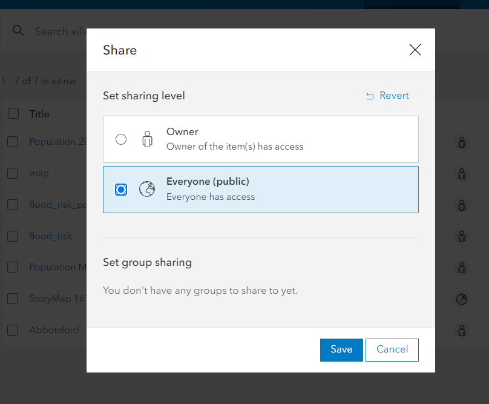

## How to publish the Story Map?

*1*{: .circle .circle-blue} Before publish the Story Map, we need to ensure the sharing level of map and feature layer matches the Story Map sharing level. In this case, let's go back to **content** and change all the sharing level as Public.

*1*{: .circle .circle-blue} Another tab on the top of the page is the **Publish**, make sure change your publish options to give the Story Map access to the viewer.

{: .note}
You can always edit a published Story Map.

