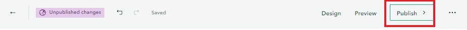

## How to publish the Storymap?

Another tab on the top of the page is the **Publish**, make sure change your publish options to give the Storymap access to the viewer.

{: .note}
You can always edit a published storymap.

