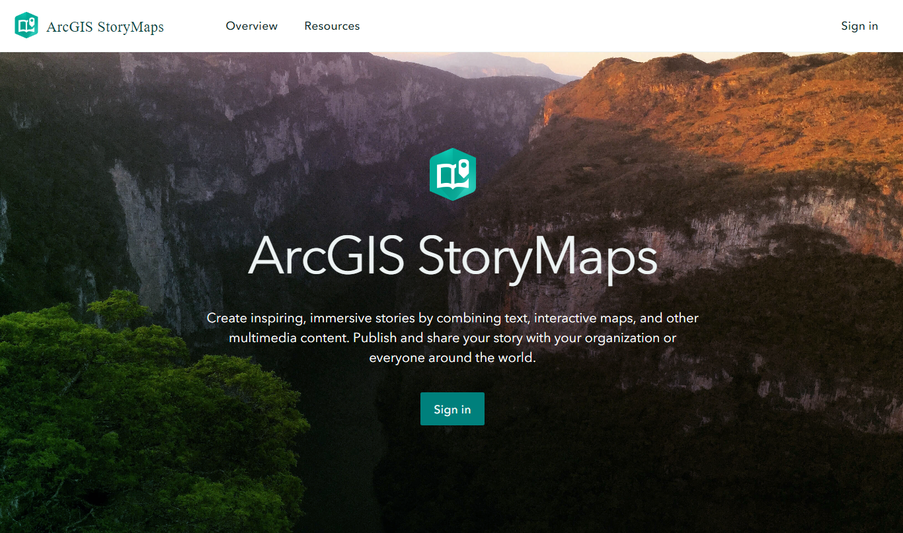
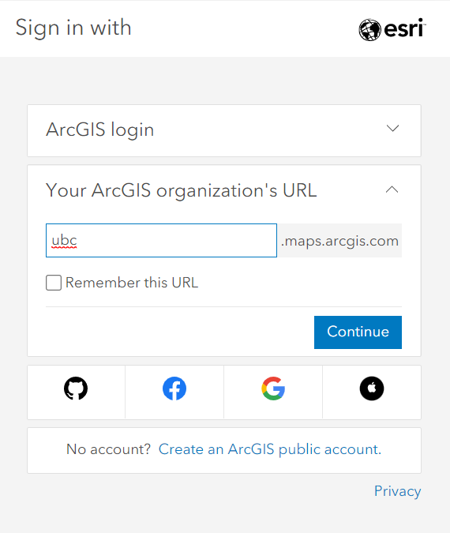
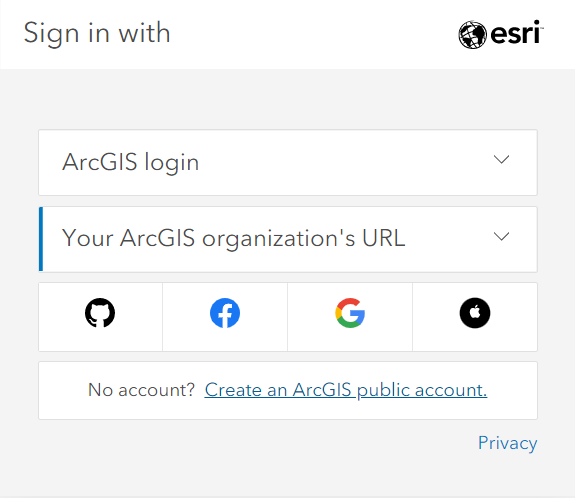
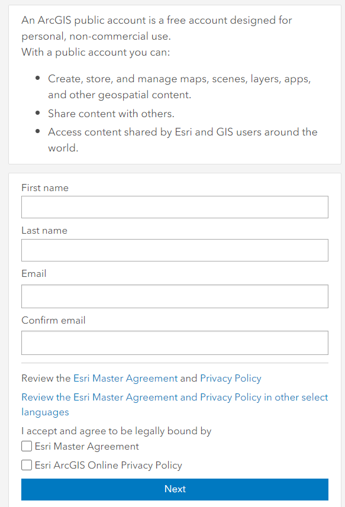

## Note: this workshop is in development and not yet complete.
## Goals

This workshop is part 2 of visualizing Data in ArcGIS Online, focusing on creating Storymap with the ArcGIS Online platform and tools. This workshop is intended for those with introductory knowledge or experience with ArcGIS Online but looking for advanced features and functions of the story maps. 

## Learning objectives

At the end of this workshop, you will be able to:
- Configuring design and themes
- Adding basic feature 
    - Text, Button, Separator, logo
- Embedding media in Story Map
    - Map, image, video, web app, swipe, timeline
- Configuring pop-ups
- Embedding immersive content
    - Sidecar, map tour, slideshow
- Publishing and sharing the story map

## Workshop Outline

- Adding and exploring data from local and ArcGIS Online
- Reviewing how to create a web map
- Creating a Storymap from scratch

## Setup

You will need to sign up for a free ArcGIS public account ahead of time. If you have an organizational account with Esri, you can choose to use your regular sign-in or create a separate free account.

1. Log in with the organization's URL

2. Click Create an ArcGIS Public Account and follow the steps below:

## Geospatial Information Resource at UBC
- General Informational website for all things UBC GIS: <https://gis.ubc.ca/>
- UBC Library’s guide for finding and working with GIS resources: <https://guides.library.ubc.ca/gis>
- Connect with UBC's GIS Slack: <https://ubcgis.slack.com/>
