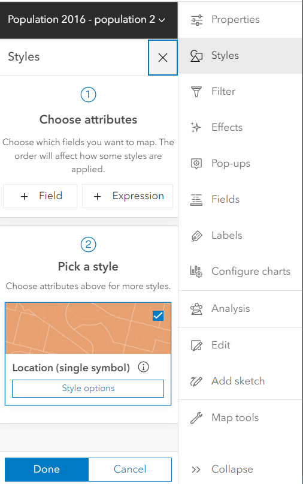
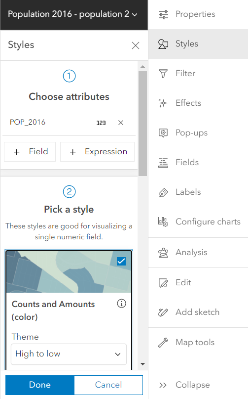
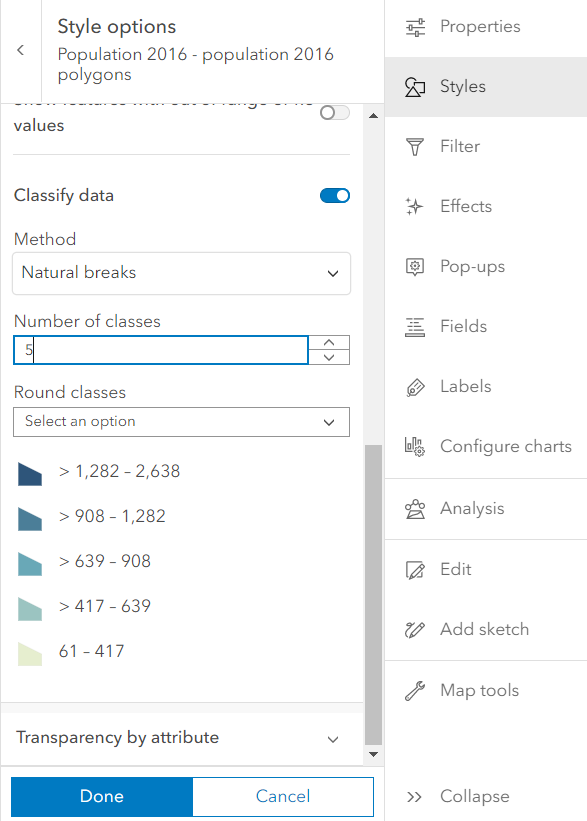

## Symbology

*1*{: .circle .circle-blue} Click on **Style**  on the right sidebar.

*2*{: .circle .circle-blue} Select **POP_2016** as the interested attribute, then pick **Counts and Amounts (color)** as a style.

*4*{: .circle .circle-blue} Click on **style option** and check **Classify data** with the **Natural Breaks** method. Enter **5** for the **Number of classes** and label each classes.

*5*{: .circle .circle-blue} Click **Done** and **Save** your map.