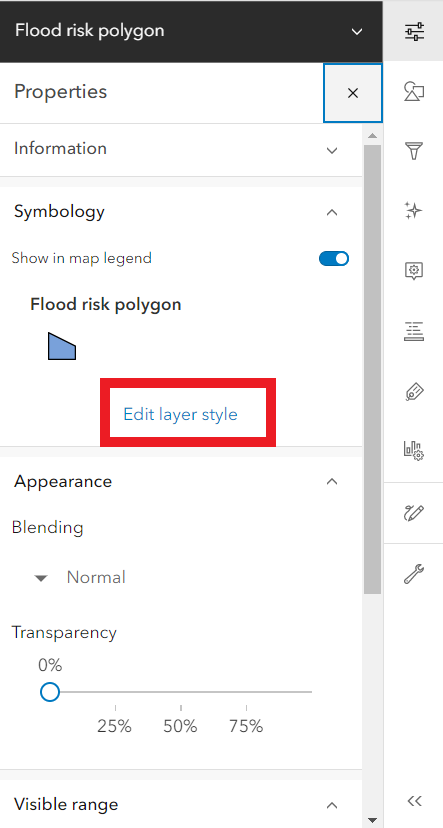
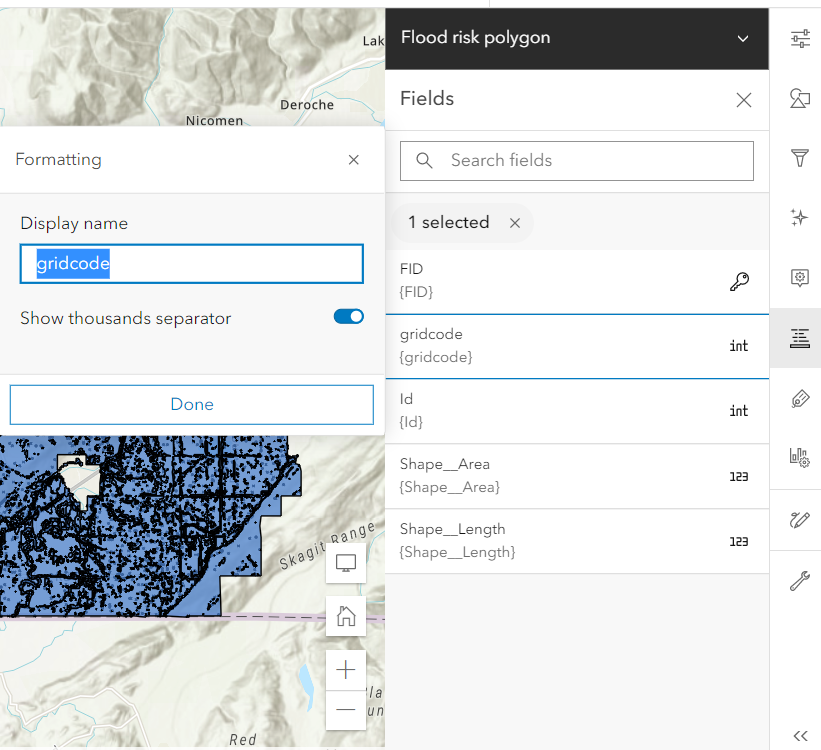
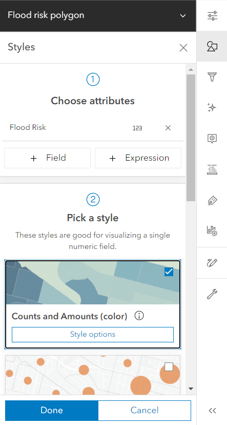
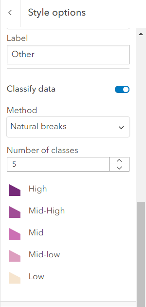

## Symbology

*1*{: .circle .circle-blue} Click on the **properties** of Flood risk polygon on the right sidebar, and then click the **Edit layer style**.

*2*{: .circle .circle-blue} Click on the **Field** of Flood risk polygon on the right sidebar and change the display name of gridcode to **Flood Risk**.

*3*{: .circle .circle-blue} Select **flood Risk** as the interested attribute, then pick **Counts and Amounts (color)** as a style.

*4*{: .circle .circle-blue} Select an appropriate **Symbol style** and **Classify data** with the **Natural Breaks** method. Enter **5** for the **Number of classes** and label each each classes.

*5*{: .circle .circle-blue} Click **Done** and **Save** your map.